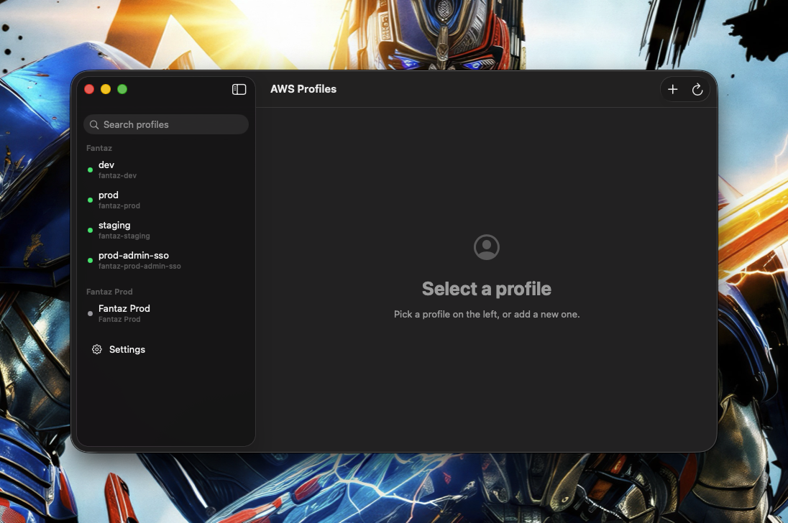
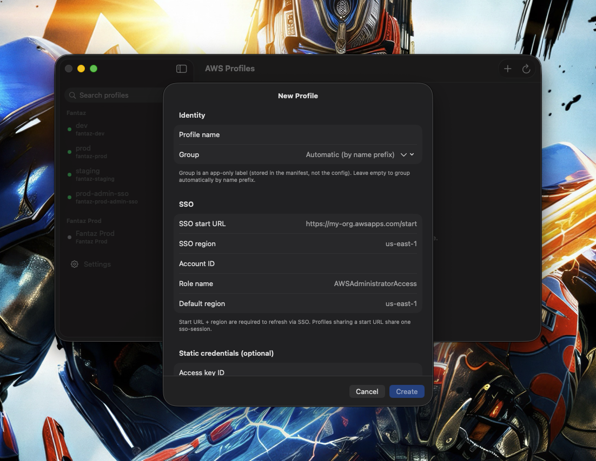
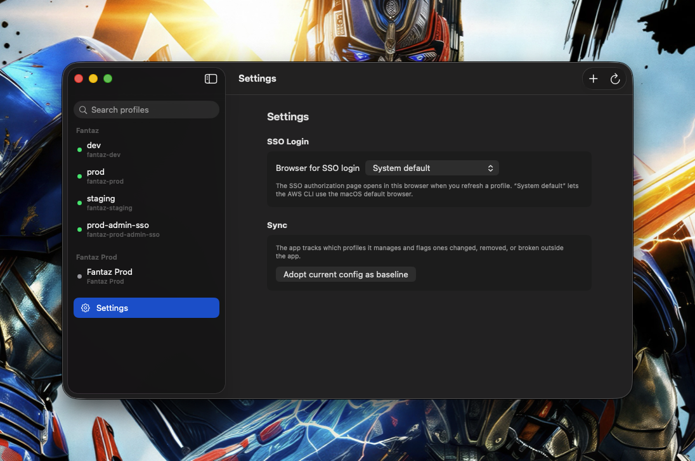

# AWS Profile Manager (macOS)

A native SwiftUI app to visually manage your AWS profiles: list and group them,
add/edit/delete entries, switch the `[default]`, and refresh SSO tokens with the
verification code shown for copying.

> **Credentials handling.** SSO authentication is delegated to the AWS CLI
> (`aws sso login`). The app reads/writes `~/.aws/config` and `~/.aws/credentials`
> and reads token expiry from the SSO cache — it never reads the cached access
> token. Static credentials you enter are written to `~/.aws/credentials` with
> `0600` permissions; backups are `0600` too.

## Screenshots

| Profiles | New profile | Settings |
|----------|-------------|----------|
|  |  |  |

## Requirements

- macOS 14+
- [AWS CLI v2](https://docs.aws.amazon.com/cli/latest/userguide/getting-started-install.html)
  at `/usr/local/bin/aws` or `/opt/homebrew/bin/aws` (or export `AWS_CLI_PATH`).

## Run in development

```bash
swift run
```

## Tests

```bash
swift test
```

Tests cover the core logic: config/credentials parsing, surgical INI editing,
sso-session dedup, the safe `[default]` rewrite (with backup), token-expiry
classification, verification-code extraction, prefix grouping, and manifest
drift sync.

## Architecture

Hexagonal + Screaming, split into two targets so the boundary is enforced by
the compiler:

- **`AWSProfileKit`** — domain + use cases + infrastructure. Does not link SwiftUI.
  - `Domain/` — `Profile`, `SSOSession`, `ProfileDisplayGroup`, `TokenStatus`,
    `LoginPrompt`, `ProfileSnapshot`, `AWSConfiguration`
  - `Ports/` — `ProfileRepository`, `SSOTokenReader`, `AWSCommandRunner`,
    `BrowserProvider`, `BrowserPreferenceStore`, `ManifestStore`
  - `Application/` — `LoadOverview`, `SaveProfile`, `DeleteProfile`,
    `SetDefaultProfile`, `RefreshSSOSession`, `SyncManifest`, `ResolveSelectedBrowser`
  - `Infrastructure/` — INI parser/editor, file repository, SSO cache reader,
    process runner, manifest store
- **`AWSProfileManager`** — the executable: SwiftUI (NavigationSplitView) +
  composition root + AppKit adapters.

## What it does

- Lists profiles **grouped in-app** by a manual label (stored in the manifest)
  or, by default, the key prefix — the config key is never changed.
- **Create / edit / delete** profiles, writing config (with a deduped
  `[sso-session]`) and credentials, always backing up first.
- Marks the current default and lets you change it (**rewrites `[default]` with a
  `config.bak.<timestamp>` backup**).
- Shows per-session token status (green / amber / red) read from the SSO cache.
- **Login / Refresh** per profile → `aws sso login --profile <name> --no-browser`,
  showing the **verification code** to copy and opening the URL in the chosen
  (or default) browser.
- **Drift sync**: flags profiles that were modified, removed, or broken outside
  the app.

## App icon

The icon is generated from code (CoreGraphics — no external rasterizer):

```bash
swift Tools/generate_app_icon.swift Assets/AppIcon.iconset
iconutil -c icns Assets/AppIcon.iconset -o Assets/AppIcon.icns
```

The runtime resource lives at `Sources/AWSProfileManager/Resources/AppIcon.icns`.

## Build the .app bundle

```bash
chmod +x Tools/build_app.sh
Tools/build_app.sh          # release build → dist/AWSProfileManager.app, signed
```

The script builds in release, assembles `dist/AWSProfileManager.app`
(Info.plist + executable + icon + the SPM resource bundle), and signs it with
Developer ID and the hardened runtime. Override the identity with
`CODESIGN_IDENTITY=...` if needed.

## Notarize

This app **cannot be sandboxed** (it needs to read `~/.aws` and run the CLI), so
it is **not** App Store eligible — distribute it notarized with Developer ID.

One-time: create an app-specific password at <https://appleid.apple.com> and
store the notary credentials in the keychain:

```bash
xcrun notarytool store-credentials "AWSPM-Notary" \
  --apple-id "<your-apple-id-email>" \
  --team-id QUH3S7GQ36 \
  --password "<app-specific-password>"
```

Then:

```bash
Tools/notarize.sh           # zips, submits, staples, and verifies
```

After stapling, `spctl -a -vvv -t exec dist/AWSProfileManager.app` reports
`accepted` and the app opens cleanly on any Mac.
